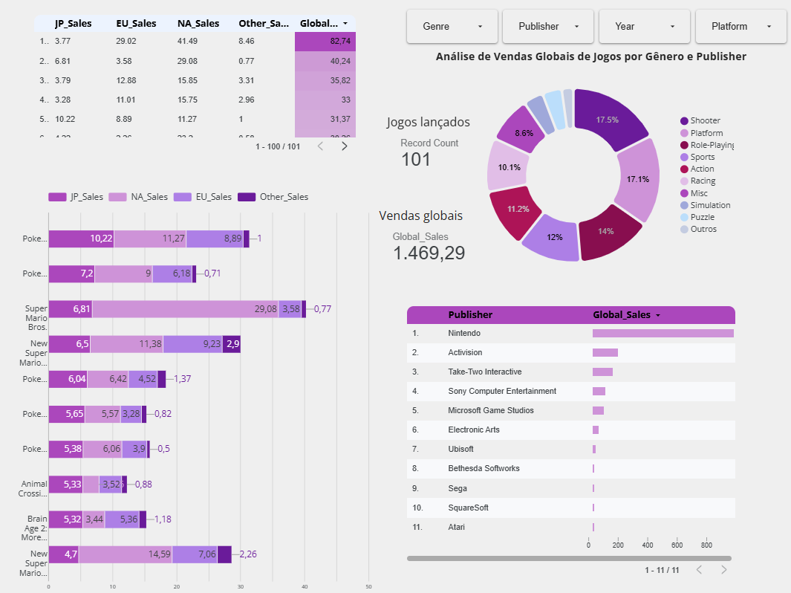
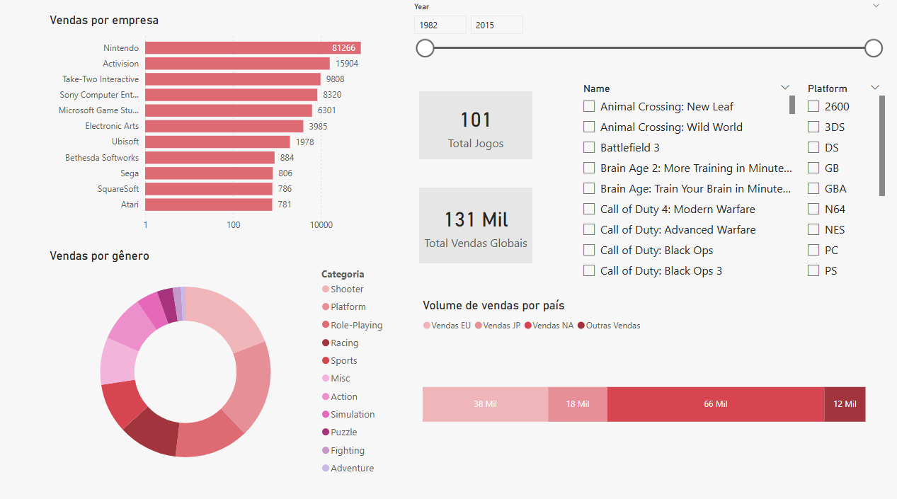

## 📊 Dashboard Looker studio(google)
dashboard desenvolvido no Looker studio para identificar padrões de consumo no mercado de jogos

🔗 **[Link do Dashboard Interativo](https://lookerstudio.google.com/s/q5pbTzhMPwU)**

* **Dominância da Nintendo:** A Nintendo lidera isoladamente as vendas globais no conjunto de dados analisado.
* **Gêneros de Sucesso:** Os gêneros de *Shooter* e *Platform* representam quase 35% do total de jogos lançados, indicando uma forte concentração de mercado nessas categorias.

### 📈 Estrutura do Dashboard
1.  **KPIs Globais:** Contagem total de registros e volume total de vendas.
2.  **Distribuição por Gênero:** Gráfico de rosca mostrando o market share de cada categoria.
3.  **Ranking de Publicadoras:** Gráfico de barras horizontais comparando o volume de vendas global.
4.  **Análise Geográfica:** Comparativo detalhado entre vendas no Japão, Europa, América do Norte e outros mercados.

## 📊 Dashboard Power BI
dashboard desenvolvido pelo PowerBI desktop com a mesma base de dados do anterior

Diferente da versão anterior, apliquei uma **escala logarítmica** no gráfico de "Vendas por Publisher",
para mitigar a disparidade visual causada pela dominância da Nintendo, 
permitindo uma comparação mais nítida e justa do desempenho entre as demais publicadoras.

### Medidas DAX
* **% Vendas por Categoria** = DIVIDE(SUM(games_dashboard[Global_Sales]), CALCULATE(SUM(games_dashboard[Global_Sales]), ALL(games_dashboard[Genre])))
* **Total Vendas Globais** = SUM(games_dashboard[Global_Sales]
* **Total Jogos** = COUNT(games_dashboard[Name])
* **Vendas JP** = SUM(games_dashboard[JP_Sales])
* **Vendas EU** = SUM(games_dashboard[EU_Sales])
* **Vendas NA** = SUM(games_dashboard[NA_Sales])
* **Outras Vendas** = SUM(games_dashboard[Other_Sales])